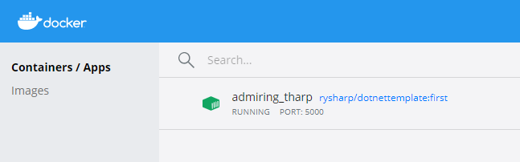

# Workshop Module 08

This repository is for learners on Corndel's DevOps apprenticeship.

If you attended workshop 7, you should continue working with the same repository. If you do not have your own solution to workshop 7 for whatever reason, then use a fork of this repository.

During this workshop follow the instructions in [during_workshop_8.md](./during_workshop_8.md).

Workshop 7's instructions are included to refresh your memory or in case you would like to go back and attempt those stretch goals.

## Build locally

Build in current directory (ensure Docker is running):

`docker build -t <hub-user>/<repo-name>[:<tag>] .`

e.g. `docker build -t rysharp/dotnettemplate:first`

Run - add the port (`-p`) argument to expose the port:

`docker run -p 5000:5000 <hub-user>/<repo-name>[:<tag>]`

Use `--name` to set the container name, otherwise the container name is generated for you as below.

## Push to DockerHub

Commit the container:

`docker commit <existing-container> <hub-user>/<repo-name>[:<tag>]`

e.g. `docker commit admiring_tharp rysharp/dotnettemplate:first`

Push the container:

`docker push <hub-user>/<repo-name>:<tag>`

e.g. `docker push rysharp/dotnettemplate:first`